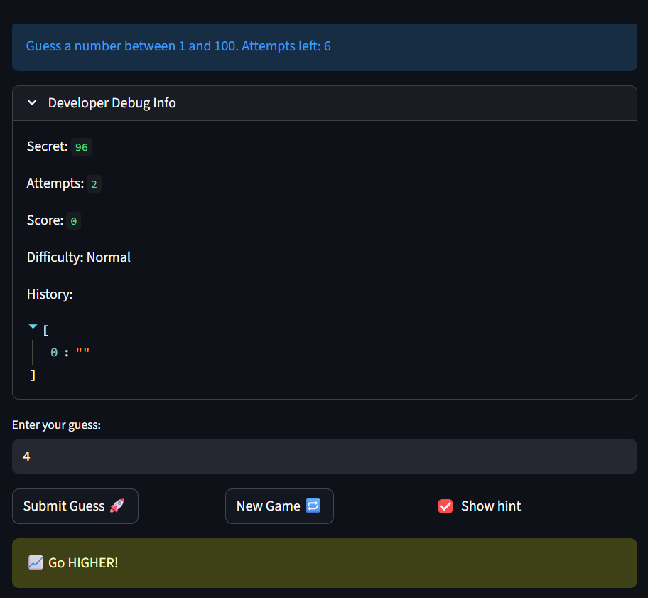

# 🎮 Game Glitch Investigator: The Impossible Guesser

## 🚨 The Situation

You asked an AI to build a simple "Number Guessing Game" using Streamlit.
It wrote the code, ran away, and now the game is unplayable. 

- You can't win.
- The hints lie to you.
- The secret number seems to have commitment issues.

## 🛠️ Setup

1. Install dependencies: `pip install -r requirements.txt`
2. Run the broken app: `python -m streamlit run app.py`

## 🕵️‍♂️ Your Mission

1. **Play the game.** Open the "Developer Debug Info" tab in the app to see the secret number. Try to win.
2. **Find the State Bug.** Why does the secret number change every time you click "Submit"? Ask ChatGPT: *"How do I keep a variable from resetting in Streamlit when I click a button?"*
3. **Fix the Logic.** The hints ("Higher/Lower") are wrong. Fix them.
4. **Refactor & Test.** - Move the logic into `logic_utils.py`.
   - Run `pytest` in your terminal.
   - Keep fixing until all tests pass!

## 📝 Document Your Experience

#### About the Game
For each game a random "Secret" number is generated based on the the difficulty level selected. The player is tasked with guessing the number generated, after every guess the game provides a hint whether the number is higher or lower than their current guess The game ends once the "Secret" number is discover or when the player runs out of guesses.

#### Bugs Found
1. Discrepancy where the number selection range from Normal difficulty to Hard difficulty decreases
2. If player finishes a game and selects "New Game" the game state is not reset
3. The game provides incorrect hints: i.e. if secret equalled 20 and the player guessed 50, the hint provided would say to "Guess HIGHER" intead of lower.

#### Fixes Applied
1. Updated the "Hard" range from "0 to 50" to "0 to 200" which is greater than the 'Normal' difficulty range from "0 to 100"
2. Added the call for a session state reset within the new_game function
3. Flipped the logic to return the correct hints

## 📸 Demo

## 🚀 Stretch Features

- [ ] [If you choose to complete Challenge 4, insert a screenshot of your Enhanced Game UI here]
